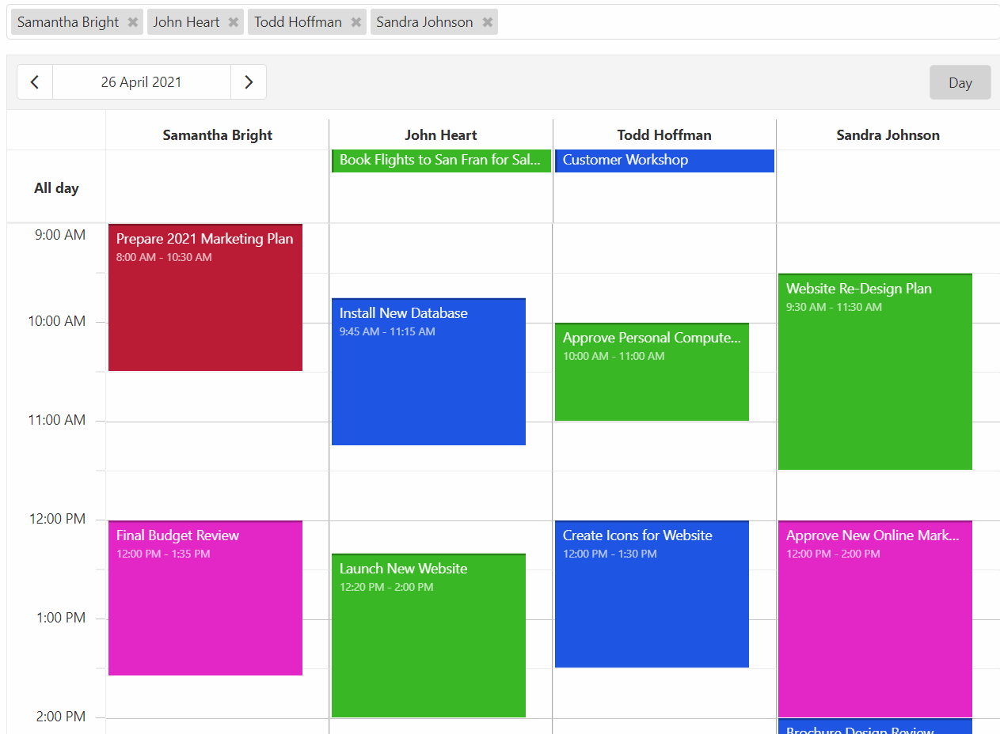

<!-- default badges list -->

<!-- default badges end -->

# Scheduler for DevExtreme - How to filter appointments by resources
This example demonstrates how to use the resource navigator to filter Scheduler's appointments

## Files to Review

- **Angular**
    - [app.component.html](Angular/src/app/app.component.html)
    - [app.component.ts](Angular/src/app/app.component.ts)
- **jQuery**
    - [index.js](jQuery/src/index.js)
- **React**
    - [App.tsx](React/src/App.tsx)
- **Vue**
    - [Home.vue](Vue/src/components/HomeContent.vue)

## Documentation

- [Getting Started with Scheduler](https://js.devexpress.com/Documentation/Guide/UI_Components/Scheduler/Getting_Started_with_Scheduler/)

- [Scheduler - API Reference](https://js.devexpress.com/Documentation/ApiReference/UI_Components/dxScheduler/)
<!-- feedback -->
## Does This Example Address Your Development Requirements/Objectives?

 

(you will be redirected to DevExpress.com to submit your response)
<!-- feedback end -->
